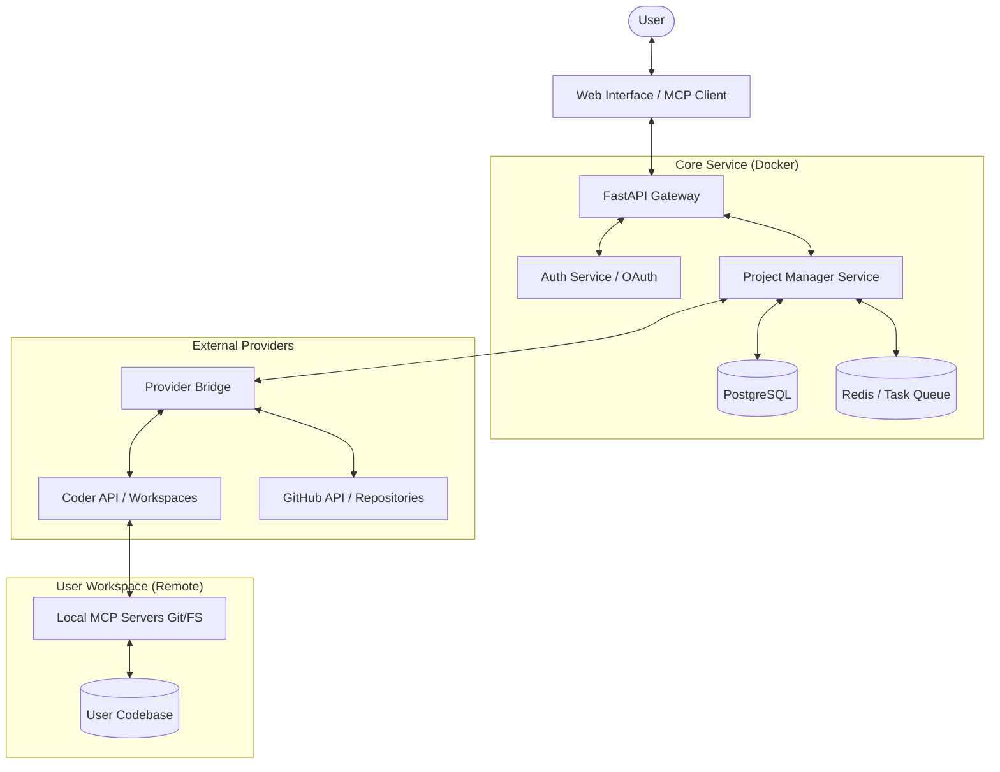

# Fulcrum - Cloud Project Management Architecture

## Overview
Fulcrum is a multi-tenant cloud service for project orchestration. It allows users to manage their software projects by connecting their own development environments (Coder workspaces) and source control (GitHub).

### Fulcrum Project Manager Agent
A central "Project Manager" agent acts as the brain of the system.
- **Global Context**: Maintains state and knowledge across all of a user's connected projects.
- **Orchestration**: Can delegate tasks, trigger workflows, and provide multi-project insights.
- **Communication Protocol (To reach external/remote tools)**: Researching MCP (Model Context Protocol) vs Agent-to-Agent (A2A) protocols for remote workspace interaction.

## Component Diagram

## Key Components

### 1. Web API Layer (FastAPI)
- **Multi-tenancy**: Every request is authenticated and scoped to a `user_id`.
- **Endpoints**:
    - Auth: `/auth/login`, `/auth/callback`, `/auth/refresh`
    - Projects: `/projects`, `/projects/{id}/status`
    - Tasks: `/tasks`, `/tasks/{id}`
    - Connections: `/connections/github`, `/connections/coder`

### 2. Multi-tenant Storage (PostgreSQL)
- **Schema**:
    - `users`: Basic user info and preferences.
    - `accounts`: Encrypted credentials for Coder/GitHub.
    - `workspaces`: Metadata about connected workspaces (Coder URL, GitHub Repo URL).
    - `tasks`: Task management data, scoped by `user_id` and `workspace_id`.

### 3. Provider Bridge
- **GitHub Connector**: Uses GitHub App or Personal Access Tokens to list repos, issues, and PRs.
- **Coder Connector**: Uses Coder API to discover workspaces and proxy commands/MCP requests to them.

### 4. Connection Strategy
- **Option A (Proxy)**: The server acts as an MCP host, connecting to the user's workspace via SSH or Coder's built-in TCP proxy, and runs commands remotely.
- **Option B (Agent)**: A small agent runs in the Coder workspace and connects back to the Cloud Server via WebSockets.

## Deployment
The entire stack is containerized using Docker Compose for development and Kubernetes for production.

### Docker Services:
1. `api`: The FastAPI application.
2. `db`: PostgreSQL instance.
3. `redis`: For session management and task queuing.
4. `worker`: Celery worker for long-running research tasks.
